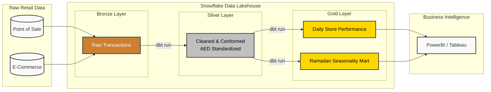

# 🇦🇪 Enterprise Retail Data Warehouse

## 📌 Architecture Overview
A production-grade, automated data pipeline engineered for high-scale retail analytics in the UAE market. This system transforms raw point-of-sale transaction data into a highly structured data lakehouse model. It features robust Medallion Architecture (Bronze → Silver → Gold), ACID-compliant transformations, and domain-specific logic (AED standardization, 5% VAT calculation, and regional mapping).

The pipeline is entirely **serverless**, utilizing GitHub Actions to securely orchestrate dbt transformations within a Snowflake data warehouse, adhering to strict FinOps principles for zero-waste compute scaling.

---

## 🏗️ System Design

---

## 🔐 Security & FinOps Infrastructure
* **Zero-Trust Credentials:** Snowflake credentials are not hardcoded. They are injected securely at runtime via encrypted GitHub Secrets.
* **Ephemeral Compute:** The GitHub Actions runner provisions just long enough to execute the dbt models and is immediately destroyed.
* **Cost Protection:** The Snowflake `COMPUTE_WH` utilizes a strict auto-suspend policy. Daily scheduled triggers are intentionally paused for this repository to enforce a zero-cost baseline.